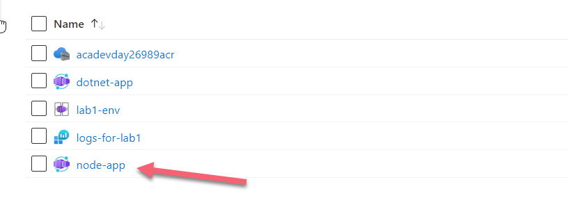
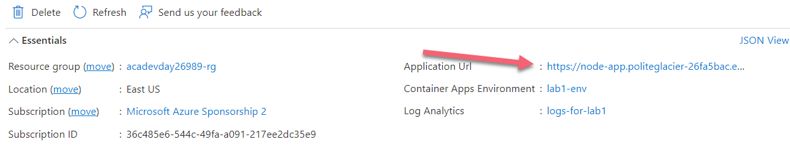
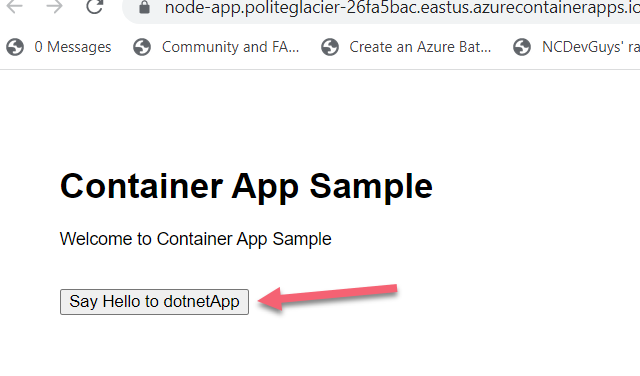
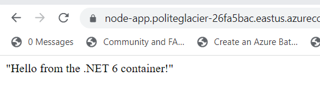

# Azure Container Apps - Multi-Container Communication

The following sample shows how to use Azure Container Apps where one container app will call another container app within the container app environment.  This is possible both with or without [Dapr](https://dapr.io).  This lab will not include Dapr.  

The `nodeApp` (container-1-node) is an express.js API that will call a `/hello` endpoint.  This route will call the `dotnetApp` (container-2-dotnet) to return a message.  
  
You will be using the [`with-fqdn`](./with-fqdn) folder. 
## Deploy and Run

### Deploy via Azure CLI
To begin the deployment process, go to the **1.ACA_Intro\with-fqdn** folder. See the README.md files within this folder for scripts to deploy lab files using the Azure CLI. Then return to this page.

### Run the application in the Azure Portal
1. If you don't already have the Azure portal open, log in to the Azure portal now.
2. Find the name of your resource group and click on the name.
3. In the resource group, click on the Container App named **'node-app'**.
  

 4. When you click on 'node-app', you will be taken to the Overview page of the container app. You need to click on the **Application URL** which will take you into the front end node app, through the ingress to the container app UI.
 

5. You should now see the node app UI. Click on the **Say Hello to dotnetApp button**.

 

 6. If your fully qualified domain name has been entered correctly into your environment variables, you should see the UI of the .Net 6 container app.

 