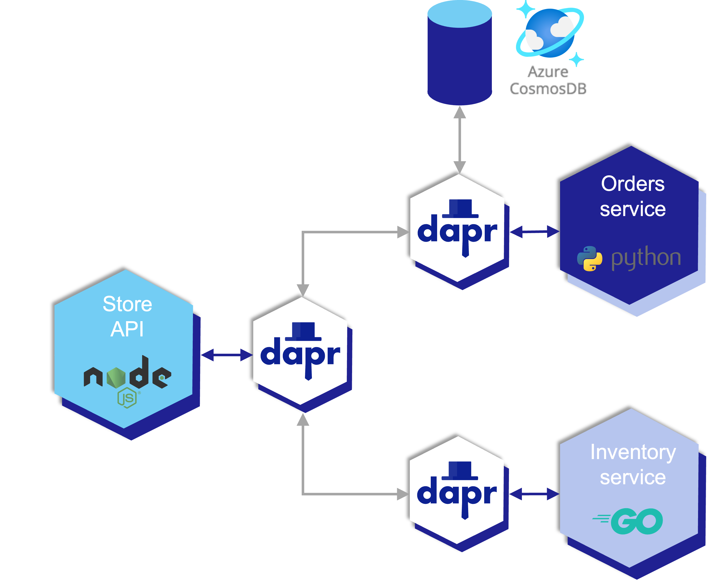
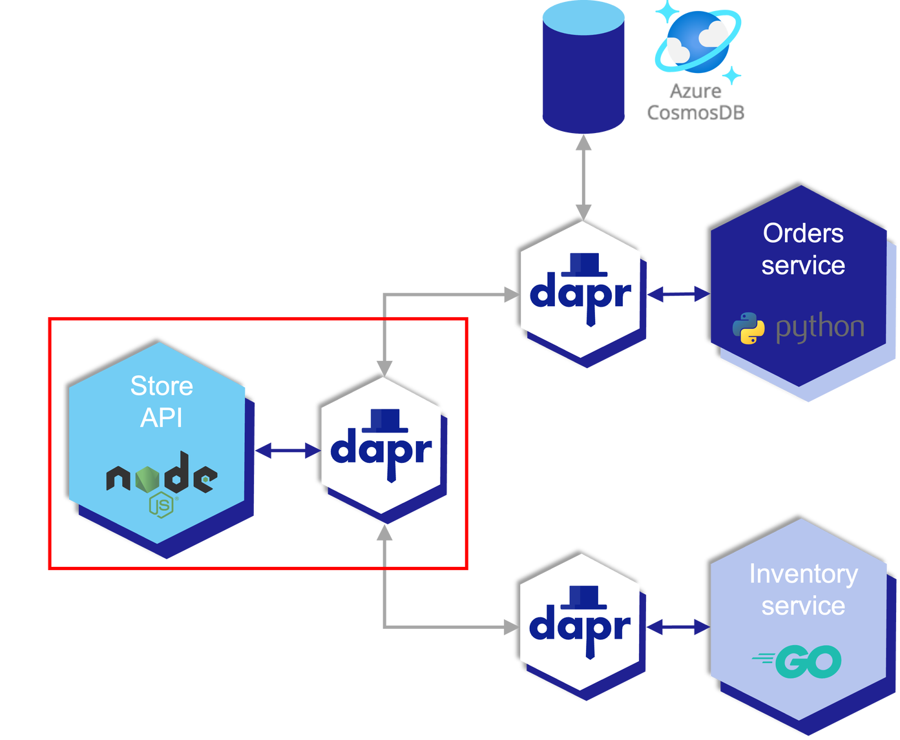
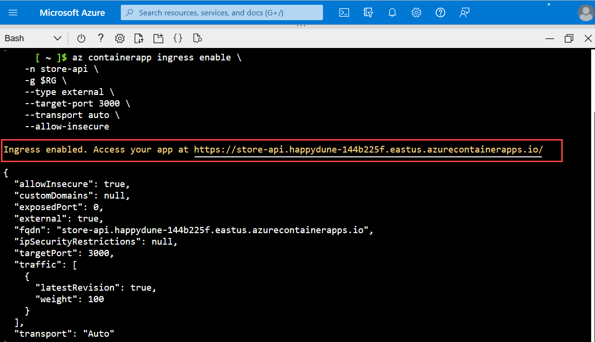
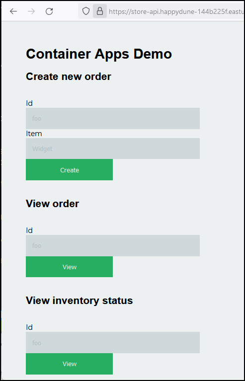
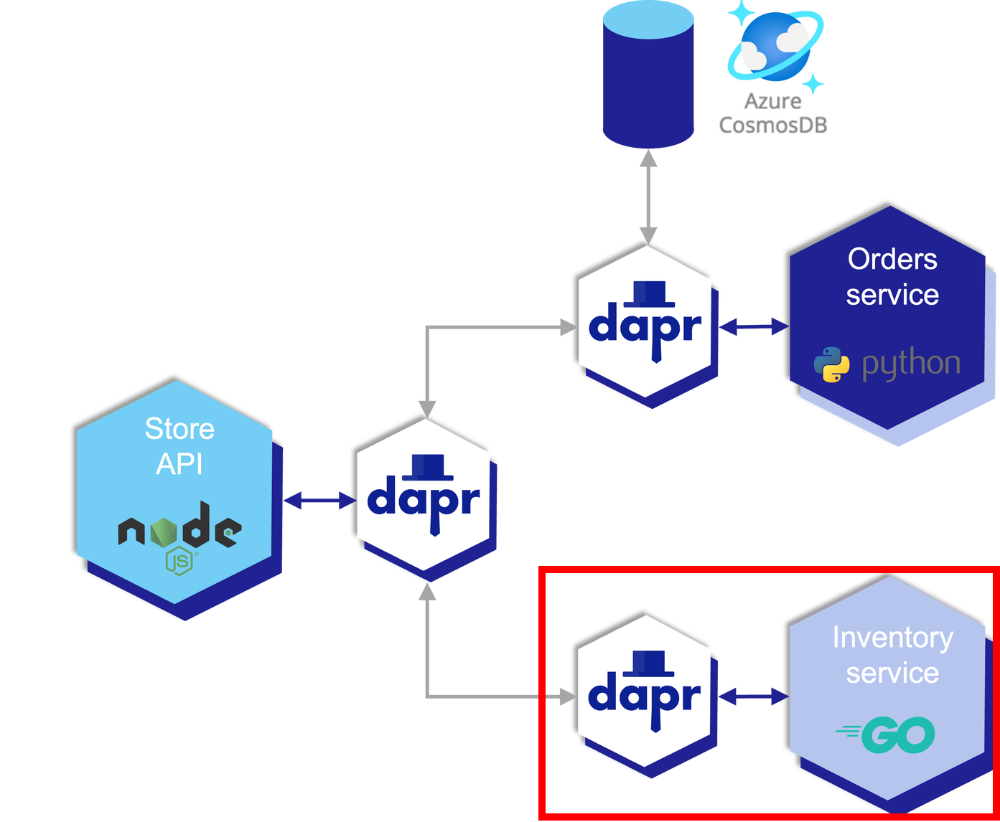
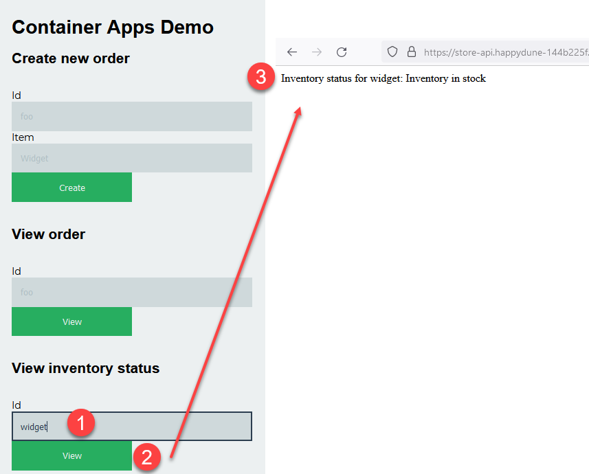
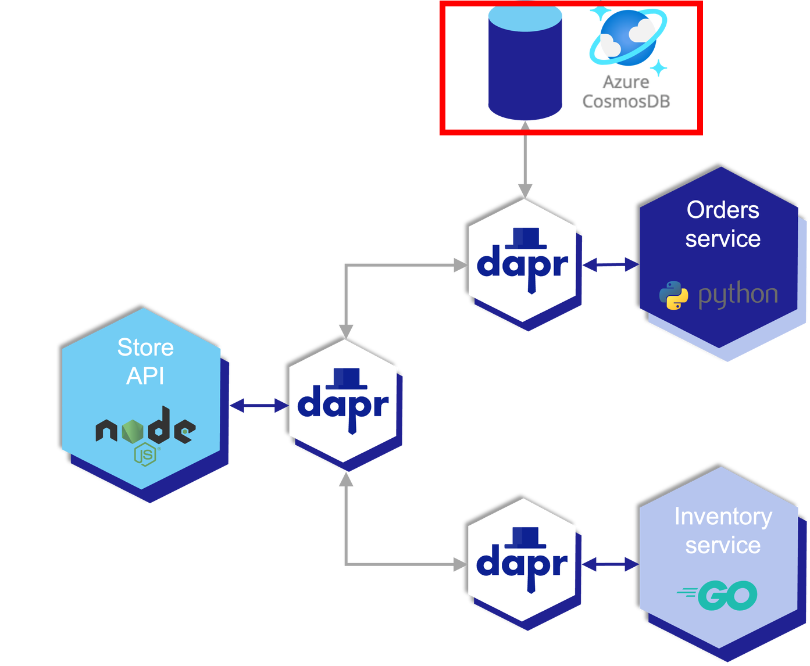
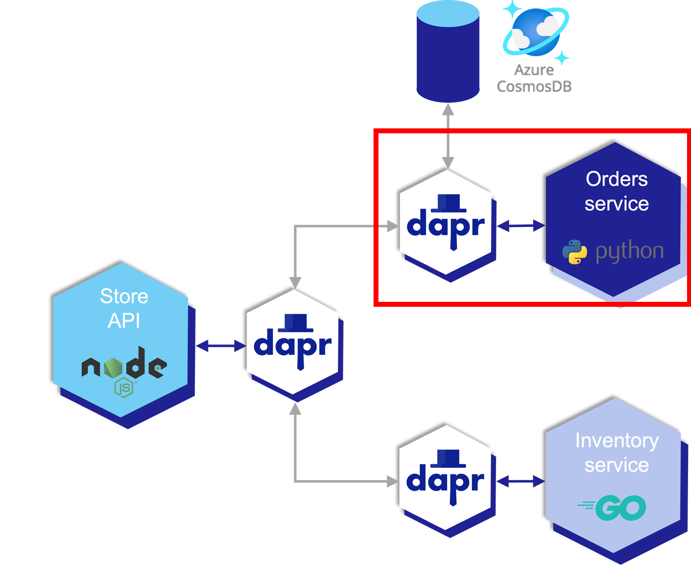
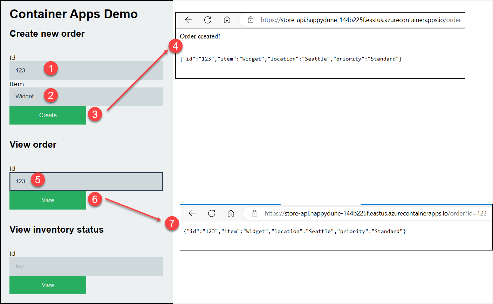

# Container Apps Store Microservice with DAPR

This repository was created to help users deploy a microservice-based sample application to Azure Container Apps.

Azure Container Apps is a managed serverless container offering for building and deploying modern apps at scale. It enables developers to deploy containerized apps without managing container orchestration. This sample makes use of the Distributed Application Runtime (Dapr), which is integrated deeply into the container apps platform.

Dapr is a CNCF project that helps developers overcome the inherent challenges presented by distributed applications, such as state management and service invocation. Container Apps also provides a fully-managed integration with the Kubernetes Event Driven Autoscaler (KEDA). KEDA allows your containers to autoscale based on incoming events from external services such Azure Service Bus or Redis.

### Application Architecture


There are three main microservices in the solution.

**Store API** (node-app)

The node-app is an express.js API that exposes three endpoints. / will return the primary index page, /order will return details on an order (retrieved from the order service), and /inventory will return details on an inventory item (retrieved from the inventory service).

**Order Service** (python-app)

The python-app is a Python flask app that will retrieve and store the state of orders. It uses Dapr state management to store the state of the orders. When deployed in Container Apps, Dapr is configured to point to an Azure Cosmos DB to back the state.

**Inventory Service** (go-app)

The go-app is a Go mux app that will retrieve and store the state of inventory. For this sample, the inventory service  just returns back a static value.

## Setup
1. Log into Azure and open the Cloud Shell. Add the Container Apps extension and finally, register the Container Apps Provider. Note that it may take a few minutes to register the provider.

1. Complete the Lab [Setup](../setup.md) and launch the  [Azure Cloud Shell](https://shell.azure.com/bash)
1. Verify the Container Apps extension is installed and the namespace is registered 
  ```bash
  az extension add --name containerapp --upgrade
  az provider register --namespace Microsoft.App
  #Change your working folder to the lab folder
  ```
4. Navigate to the correct directory 
  ```bash
  cd ./3.ACA_and_Dapr
  ```
5. Next, setup the following environment variables
  ```bash
  RG="acadevdays_rg"
  LOCATION="eastus"
  ACA_ENV="aca-dapr"
  DBNAME="orderDB"
  ```

## Store API
Create the Store API microservice and Dapr module.


#### 1. Deploy API Service
The [az containerapp up](https://learn.microsoft.com/en-us/azure/container-apps/containerapp-up) command is the fastest way to deploy an app in Azure Container Apps from an existing image, local source code or a GitHub repo. In this lab we will use the ```up``` command to create the entire Container Apps environment and related resources.  The following command will:

  1. Create a resource group.
  1. Create an environment and Log Analytics workspace.
  1. Create a registry in Azure Container Registry.
  1. Build the container image using the provided Docker file
  1. Push the image to the registry.
  1. Create and deploy the container app.
  

```bash
az containerapp up \
--name store-api \
--source ./node-service \
--environment $ACA_ENV \
--location $LOCATION \
--resource-group $RG \
--env-vars INVENTORY_SERVICE_NAME=inventory-svc ORDER_SERVICE_NAME=order-svc DAPR_HTTP_PORT=3500
```
  NOTE: the environment variables are used by the ***store-api*** application to reference the DAPR service names.  
  ```
    INVENTORY_SERVICE_NAME = Dapr name for the Inventory microservice
    ORDER_SERVICE_NAME = Dapr name for the Order microservice
  ```

#### 2. Enable Dapr
Enable the dapr sidecar and register the service name ```store-api```
```bash
az containerapp dapr enable \
    -n store-api \
    -g $RG \
    --dapr-app-id store-api \
    --dapr-app-port 3000
```

#### 3. Configure Ingress
Enable the external Ingress controller and allow public access to the store-api service 
```bash
az containerapp ingress enable \
    -n store-api \
    -g $RG \
    --type external \
    --target-port 3000 \
    --transport auto \
    --allow-insecure
```
Output 


Open your browser and navigate to the URL displayed in the output.  
> NOTE: If you are using the Azure Shell you can ```CTRL-Click``` the link to open your browser



>NOTE: No other services are running so clicking on any buttons will produce an error

## Inventory Service
Create the Inventory microservice and Dapr module.


#### 1. Deploy Inventory Service
```bash
az containerapp up \
  --name inventory-svc \
  --source ./go-service \
  --environment $ACA_ENV \
  --location $LOCATION \
  --resource-group $RG \
  --ingress internal
```

#### 2. Enable Dapr
```bash
az containerapp dapr enable \
    -n inventory-svc \
    -g $RG \
    --dapr-app-id inventory-svc \
    --dapr-app-port 8050
```
#### 3. Verify
Verify the Inventory microservice is deployed correctly and the ***store-api*** can communicate with it. 

In the Container Apps Demo web page, enter **any text** for the **id** in the "***View Inventory Status***" section, then press the "***View***" button. The result should be a message indicating the inventory is in stock



## Create the Cosmos Database
With the environment deployed, the next step is to deploy an Azure Cosmos Database that is used by Orders microservices to store data. 



#### 1. Create a Unique Identifier
The name of the Cosmos DB must be globally unique. Generate a random number that will be used in the name of the Cosmos database
```bash
unique=$RANDOM
```

#### 2. Create Cosmos DB Account 

```bash
az cosmosdb create --name ordersaccount-$unique --resource-group $RG 
```

#### 3. Create a database of type SQL API 
```bash
az cosmosdb sql database create \
--account-name ordersaccount-$unique \
--resource-group $RG \
--name ordersDB
```

#### 4. Create orders collection
```bash
az cosmosdb sql container create \
--account-name ordersaccount-$unique \
--resource-group $RG \
--database-name ordersDB \
--name orders \
--partition-key-path "/partitionKey" \
--throughput 400 
```

## Deploy Dapr Component for CosmosDB
Next, create a State Management Dapr component that will be used by the Orders microservice to store information about processed orders. 

### Create the Dapr storage component

#### 1. Get the URL parameter. 
> Save this information, you'll need it to update the YAML file 
```bash
az cosmosdb show -n ordersaccount-$unique -g $RG --query documentEndpoint -o tsv
```

#### 2. Get the Cosmos Database  Key.  
> Save this information, you'll need it to update the YAML file 
```bash
az cosmosdb keys list -n ordersaccount-$unique -g $RG --query primaryMasterKey -o tsv
```
#### 3. Update the Dapr component YAML file 
```bash
code ./cosmosdb.yaml
```
```yaml
componentType: state.azure.cosmosdb
version: v1
metadata:
  - name: url
    value: #<REPLACE-WITH-URL>
  - name: masterKey
    value: #<REPLACE-WITH-MASTER-KEY>
  - name: database
    value: ordersDB
  - name: collection
    value: orders
scopes:
  - order-svc
```

a. Replace ```#<REPLACE-WITH-URL>``` with the output from step 1 above.

b. Replace ```#<REPLACE-WITH-MASTER-KEY>``` with the output from step 2 above.

c. Save the file and close the editor.


#### 4. Deploy DAPR component 
```bash
az containerapp env dapr-component set \
    --name aca-dapr \
    -g $RG \
    --dapr-component-name orders \
    --yaml cosmosdb.yaml
```


## Deploy the Orders Service


1. Deploy Orders Service
```bash
az containerapp up \
  --name order-svc \
  --source ./python-service \
  --environment $ACA_ENV \
  --location $LOCATION \
  --resource-group $RG \
  --ingress internal \
  --target-port 5000
```

2. Enable Dapr
```bash
az containerapp dapr enable \
    -n order-svc \
    -g $RG \
    --dapr-app-id order-svc \
    --dapr-app-port 5000
```
### Verify Application 
In your browser, navigate to the url for the store-api application
```bash
echo https://$(az containerapp show -n store-api -g $RG --query properties.configuration.ingress.fqdn -o tsv)
```



  #### Container Apps Demo
  1. Enter an Order ID of "123"
  2. Enter an inventory Item of "Widget"
  3. Press the "Create" button. 
  4. The browser should display the "Order Created" message and the order data. 
  #### View Order
  5. Enter "123" for the Order ID
  6. Press the "View" button
  7. The browser should display the orders information in JSON format

## Congratulations
Congratulations, you've successfully created an Azure Container Application with DAPR integration 


