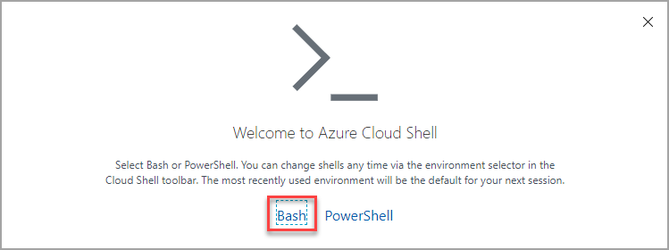
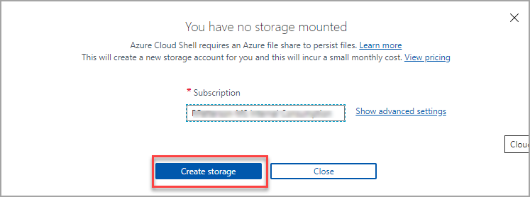

# Setup environment for the labs

Instructions to setup the environment for Azure Container Apps (ACA) labs

>Duration 20 minutes

## Task 1: Setup Cloud Shell

In this exercise you log into your Azure Subscription and launch the Bash [Azure Cloud Shell](https://docs.microsoft.com/en-us/azure/cloud-shell/overview). The Azure Cloud Shell will give you a Linux shell prompt with all the required software installed and configured.

1. [Launch Cloud Shell](https://shell.azure.com/bash)

1. When prompted, Log into your Azure Subscription
1. If this is your first time launching the Azure Cloud Shell, you will need to create a storage account.

    1. Choose Bash shell

    

    1. Create Cloud Storage

    

    
    > Use ***shift+insert*** to paste the commands from this document into the cloud shell terminal

## Task 2: Create an Azure Container Registry
In this task you will create an Azure Container Registry and later you will use this registry to pull container images from.

1. First, generate a unique name and create a resource group to organize the resources we will create in the Lab.  An Azure resource group is a logical container into which Azure resources are deployed and managed. You may want to write down the name of the resource group after its created so you can use it later.

    ```bash
    aca_name="acadevday"$RANDOM
    rg=$aca_name"-rg"
    az group create -n $rg --location eastus
    ```

>NOTE: The registry name must be globally unique, 5-50 alphanumeric characters.

2. Generate a unique name for the Azure Container Registry name
    ```bash
    acr_name=$aca_name"acr"
    ```

1. Create the Azure Container Registry
    ```bash
    acr_server=$(az acr create \
        --resource-group $rg \
        --name $acr_name \
        --sku Basic \
        --query loginServer -o tsv)
    ```


## Task 3: Clone the Git repository into your Cloud Shell environment

Within your Cloud Shell window, running the following command in order to pull down the source code for the labs:
```bash
    git clone https://github.com/microsoft/aca-dev-day.git
    ls
```
You should see an **aca-dev-day** folder in your Cloud Shell window. Change to the labs folder:
```bash
    cd aca-dev-day/labs
```
